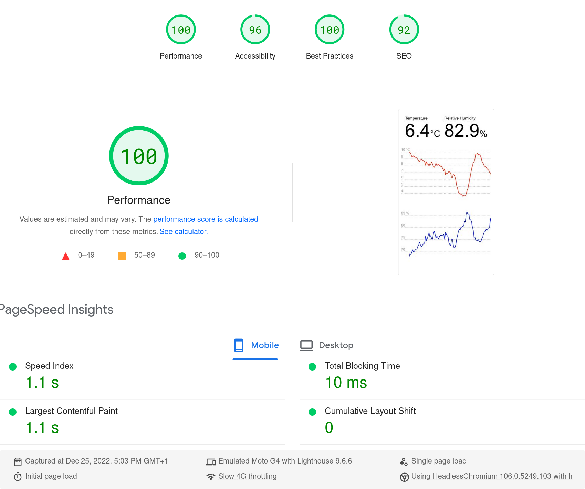

# weather-v3

This is the third iteration of my simple weather station using an AM2302
sensor, this time with a SvelteKit web app and SQLite.

The system has two parts:

- [Base station](weather-station/README.md) with sensor, taking regular
  measurements and uploading them to the backend whenever it has connectivity
- [Backend and client](weather-app/README.md) for storing and interacting with
  current and historical readings

What's cool about it?

- With Svelte and SvelteKit it's possible to develop incredibly lightweight
  applications. In fact, this one doesn't even require JavaScript on the client
  to work.
- SQLite's file-as-DB approach is perfect for this kind of application.
- The whole project is extremely minimal and simple. In terms of logic, it only
  has 300+ lines of actual code for both the base station and backend + client.
  Granted, it's a very basic use case with only a single page and going for a
  full framework like SvelteKit is overkill, but I really wanted to try 1.0 now
  that it's out and I couldn't be happier with it.
- All of the above makes for a really fast page and it does get a perfect
  performance score on [PageSpeed Insights](https://pagespeed.web.dev).
  

## License

[MIT License](LICENSE)
